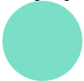

# Library Overview - Colorama
## 1. Which package/library did you select?
For exploration activity 2 I chose the racket library [image](https://docs.racket-lang.org/teachpack/2htdpimage.html) is from the racket package [2htdp](https://docs.racket-lang.org/teachpack/2htdp2htdp.html).


## 2. What is the package/library?
The package we are focused on is [2htdp](https://docs.racket-lang.org/teachpack/2htdp2htdp.html). This package can be used to make games or applications using racket. The package functionality allows you to create windows where mouse and keyboard i/o is used, draw shapes, play sounds, open webpages, use resources for making games, and other helpful tools.


Within this package we will be taking a deep dive into the /[image](https://docs.racket-lang.org/teachpack/2htdpimage.html) library. The image libarary allows racket users to combine shapes in many different ways.


### Creating Shapes
Each shape drawn using the image library is also known as an image. There are many different basic shapes that can be created using different functions through this library. These shapes have different parameters based on what shape that can affect the shape's colour, size, how the shape is cloured, etc. These shapes include, circles, rectangles, squares, ellipses, wedges, lines, text, rhombus', stars, and polygons. See some examples below. <br>


<br>


Other functions are available to add lines or shapes on top off other shapes and modify shapes in differnt ways.


Polygons specifically are very costomizable, allowing users to  make extremely complicated shapes. Such as the one below.<br>
<br>


### Overlays, Underlays, and arranging images
Overlays allow images (shapes) to be combined into one image. There are multiple types of overlay functions allowing users to have control over how images are laid on top of one another. <br>
<br>
Similarly there are underlays, which have similar functionality but places images under oneanother instead.<br>
<br>
Another way to arrange images is using the beside and above functions. Similar to overlay and underlay there are functions to further customize the arrangement of shapes. See an example below. <br>
<br>


Pinholes are also a tool to help with shape alignment within and overlay or underlay. You can place points on a shape to later attach other shapes to. The point can be removed by another function afterwards.


### Scenes
Scenes are used to contain images (shapes) in a given space, preventing windows from exapanding with windows when using 2htdp's universe library. By placing an image you can add it to a scene. You can create a scene using the empty-scene function then add new images (shapes) and position them using the place-image or place-images function.


Lines and curves can also be added to scenes by using scene+line and scene+curve.


### Editing images
There are multiple ways that users of this library can edit the images they make including rotating, scaling, flipping, cropping and framming. Each edit has it's own method that and image is passed into as one of the parameters. Some examples are shown below. <br>


<br>


### Bitmap
Functions within the image library allow users to import images via file or url to use in their programs. This can help with creating images that may be complicated to create using basic shapes. You can also export images to bitmaps and colour palettes of images to bitmaps using this library.


### Creating Colours
As mentioned these images and shapes can be coloured. There is a wide variation of preset colours to use for this. On the other hand users can create their own colours using rgba format.


### Pen
Pens are used to style lines, curves, and shapes that use the "outline" style. Users can create new pens that can be changed in colours, gaps, size, rounded or straight ends. <br>
<br>


### Saving Images
Images created within racket programs can also be saved using functions from within the image library. Images can be saved as svg or other common file types.


## 3. What are the functionalities of the package/library?
To import the image library the require statement should be formatted like so at the begining of your racket program:<br>


```
(require 2htdp/image)
```


There are many different functions within this library with many different applications. Due to this I will not be showing every single function off. Instead I will focus on image creation and editing as that is most of what I did in the example program.


### Creating shapes
First we will create a shape, a star. It is important to note if you want to make a different shape you may have to include different parameters and the function name will instead be the shape you are creating.


```
(star 50 "solid" "Yellow")
```
If displayed the shape will appear like so:<br>
<br>


### Editing Shapes
I will demonstrate each of the editing transformations available through this library. Each transformation will be performed on the star we just created. I will demonstrate how multiple edits can be stacked in one line of code.


Rotate
```
(rotate 45 (star 50 "solid" "Yellow"))
```
When displayed the shape will appear like so:<br>
<br>


Scale
```
(scale 2 (rotate 45 (star 50 "solid" "Yellow")))
```
When displayed the shape will appear like so:<br>
<br>


Flip
```
(flip-horizontal (scale 2 (rotate 45 (star 50 "solid" "Yellow"))))
```
When displayed the shape will appear like so:<br>
<br>


Crop
```
(crop 0 0 100 100 (flip-horizontal (scale 2 (rotate 45 (star 50 "solid" "Yellow")))))
```
When displayed the shape will appear like so:<br>
<br>


Frame
```
(frame (crop 0 0 100 100 (flip-horizontal (scale 2 (rotate 45 (star 50 "solid" "Yellow"))))))
```
When displayed the shape will appear like so:<br>
<br>


### Creating a Colour
Now I will exemplify how to make a new colour and how to apply it to a shape.
```
(define newCol (make-color 123 223 200))
```


Now that a colour has been created we will apply it to a new shape.
```
(circle 50 "solid" newCol)
```
When displayed the shape will appear like so:<br>
<br>


### Overlaying and Underlaying Shapes
Now that I have made two different shapes I will combine the two using one of the many overlay functions. Please note you can stack these overlay and underlay functions in a usual program to make complicated shapes.
```
(define newCol (make-color 123 223 200))


(overlay/align/offset
   "middle" "middle"
   (star 50 "solid" "Yellow")
   0  0
   (circle 50 "solid" newCol))
```
When displayed the shape will appear like so:<br>
<br>


These are just some of the functionalities offered by the image library coming from the 2htdp package.


## 4. When was it created?
The latest release of [2htdp](https://github.com/racket/htdp) was released December 2023, and was first released 10 years ago (2014).


The latest release of [image](https://github.com/racket/htdp/blob/master/htdp-lib/2htdp/image.rkt) was released in 2021, and was first released 10 years ago (2014).


## 5. Why did you select this package/library?
I really wanted to make connect 4, that is the only reason why. My friends and I have a connect 4 leaderboard. I knew I wanted to do something with racket as I was least comfortable with it. So I found some libraries that would suit the task by looking into how games can be made in racket.


## 6. How did learning the package/library influence your learning of the language?
This was a great test to see how comfortable I am with recursive programming. It also gave me a chance to learn about how objects work in racket before lab 19 and assignment 3 came around. This also was a fun task as doing ui work is something I enjoy so being able to do it in yet another language made me happy.


## 7. How was your overall experience with the package/library?
It was a pretty decent experience, there is a lot of documentation for these two libraries even if it can be a bit overwhelming at first. The biggest challenges were to understand what the big bang function was meant to do and deciding which was the best way to set up the connect 4 board. It was also a little difficult for me initially to find out how to change more than one shape when the world was drawn, but after tinkering around I got it to work. When it came to specifically the image library I only had issues trying to figure out what overlays were best to use for creating the connect4 board.
