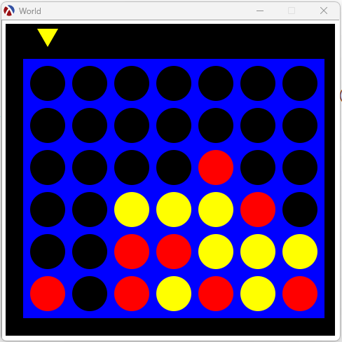
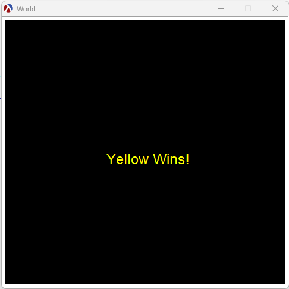
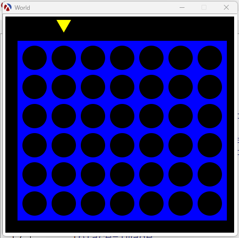
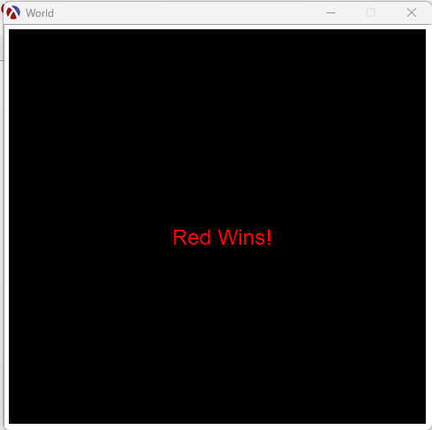
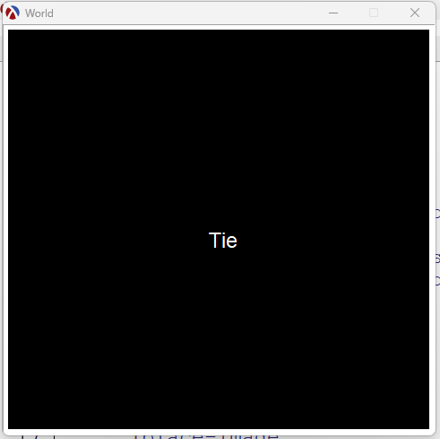

# Exploration Activity 1 ReadME - 2htdp

## 1. Which package/library does the sample program demonstrate?
In exploration activity 1, I demonstrate features from libraries offered by the most recent version of the racket package 2htdp (specifically the /universe and /image libraries).

## 2. How does someone run your program?
For this program please ensure you have [racket](https://download.racket-lang.org/) installed on your computer before performing the following steps.
First download the code from [the GitHub repository](https://github.com/CS2613-WI24-FR01B/exploration-activity-1-emercer2).
There is one file to note in this repository called EA1.rkt which is the racket program. 

For this program three different libraries from the htdp package are used and will need to be installed to run the program. All three should already be included in your basic racket installation.  

Packages used:
- [2htdp/image](https://docs.racket-lang.org/teachpack/2htdpimage.html) - Used to draw shapes.
- [2htdp/universe](https://docs.racket-lang.org/teachpack/2htdpuniverse.html) - Used to create a window and track the interactions within it.
- [lang/posn](https://docs.racket-lang.org/htdp/index.html#%28mod-path._lang%2Fposn%29) - Used to make the program more simple, provides funtionality for a simple x y position object.  
(the 2htdp library will be discussed further within the related markdown files)

 After that you can run the program by pressing the run button in DrRacket.

## 3. What purpose does your program serve?
This program is a working version of [connect 4](https://www.unco.edu/hewit/pdf/giant-map/connect-4-instructions.pdf) made in racket. This game is to be played with two players one each assigned a colour. Once a line is made with the pieces (horizontal, vertical, or diagonal) the player with the line wins and the game resets.

## 4. What would be some sample input/output?
After running the program a window will appear with the connect 4 board. The triangle above the blue board shows the current player colour and where the next piece will drop if the player were to click the mouse. Input is completely up to the player as they can place pieces by clicking wherever they feel fit. Once a line has been made or the board has been filled, a screen with text will display one of these messages: "Red Wins!", "Yellow Wins!", or "Tie". 

All input is done by moving the mouse and clicking within the window. All output is displayed within the window visually to the user based on the interactions. 

Example of a user winning: 
each piece shown would be placed one by one by the players as they alternate turns. Below shows a board that is partially filled. Note that yellow is about to make a diagonal line of 4 pieces. 
 
After placing the piece to make the diagonal line this message will appear on screen.  
 
After clicking, the game will reset for another round.  
 
Other ending options include red wins and tie (no lines made and the board is full): 
Red Wins!  
 
Tie  
